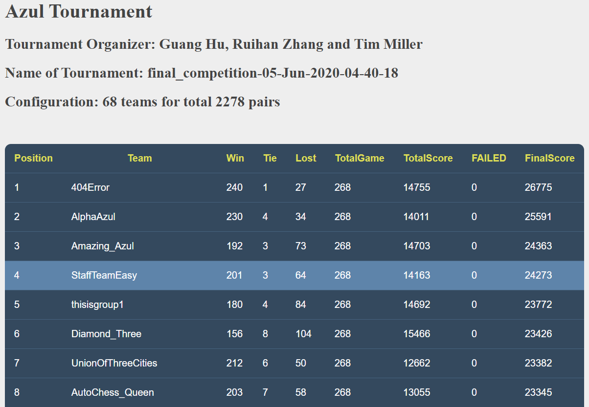
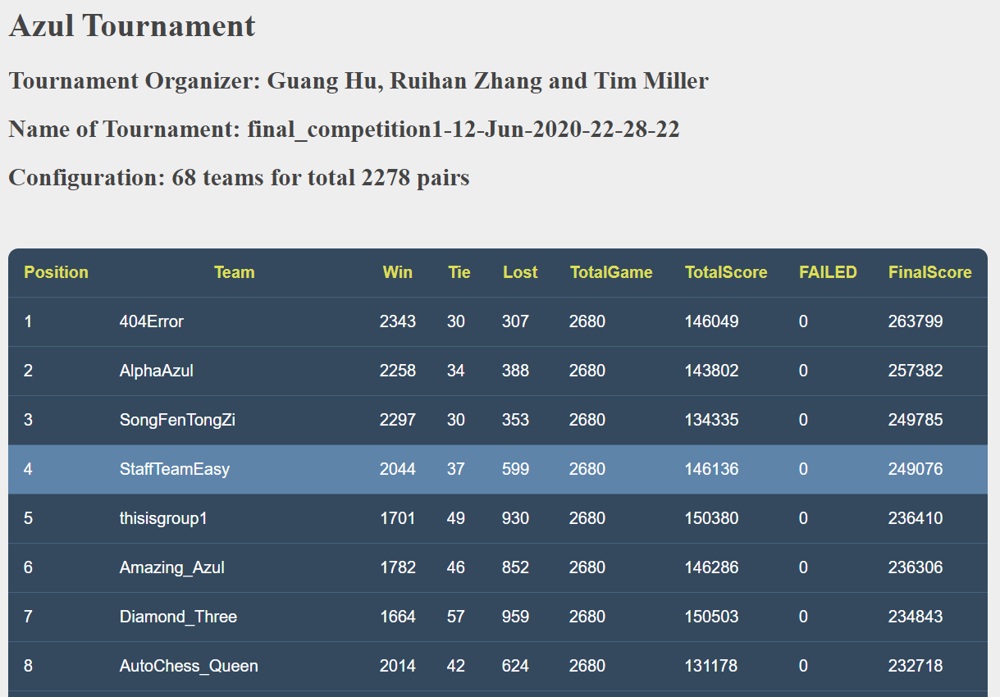
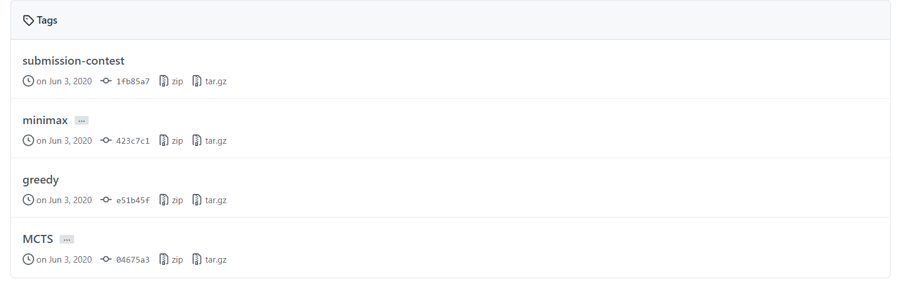

<!-- # AZUL
This repository contains a framework to support policy learning for the boardgame AZUL, published by Plan B Games. The purpose of this framework is to allow students to implement algorithms for learning AI players for the game and evaluate the performance of these players against human/other AI players. 

Students making use of the framework will need to create a Player subclass for their AI player that selects moves on the basis of a learned policy, and write code to learn their policy on the basis of repeated simulations of the game.

Some information about the game:
- https://en.wikipedia.org/wiki/Azul_(board_game)
- https://www.ultraboardgames.com/azul/game-rules.php
- https://boardgamegeek.com/boardgame/230802/azul
- https://www.planbgames.com/en/news/azul-c16.html -->

# Report
- [link](./docs/COMP90054_Assignment_3_Report.pdf)

# Presentation
- [link](https://youtu.be/kd_EsLFdQzE)

# Competition
- Rank 4/68 
  - 
  - [details](./docs/competition_results/)

# Implemented agents
- 

# Results
- ```
  Dear Xulin Yang:

    This email is automatically generated as the feedback on your score for the  
    Azul Group Project. Your total score is:

    (28.27/7)

    ---------------------- Your Team details ------------------------
    [Team Name]: StaffTeamEasy
    [Team Url]: https://gitlab.eng.unimelb.edu.au/xinyaon/comp90054-2020s1-azul

    ---------------------- Team Score Details -----------------------
    Code Performance:
    [Rank]: 4 out of 65 teams, which is the highest rank between two final  
    tournaments
    [Score]: (8.77/10), which is your team's highest score between two final  
    tournaments

    Video:
    [Score]: (3.5/5)
    [Feedback]: "Video presentation is clear but  lacks stucture. Demos could  
    be improved by showing weekness and stength of different agents.  
    Presentation not of high quality, or some design decisions/challenges  
    missing"

    Report:
    [Score]: (16/20)
    [Feedback]: "Good structure or writing; Decision decisions/techniques  
    unclear. Techniques used should be explained (MCTS); Chosen techniques  
    suitable but a limited justification of why techniques are chosen.  
    Improvement suggested bit week."

    Penalty:
    [Percentage]: 0%
    [Feedback]: N/A

    Team Total score: (28.27/35)

    ---------------------- Individual Score Details --------------------
    Contribution penalty: 0%
    Final Individual Score: (28.27/35)


    ------------------ Important Message ---------------
    1. Please check your team details to make sure those information are  
    correct:)
    2. If your contribution penalty is not 0%, which means there is a conflict  
    of contribution distribution in your team. You should have received an  
    email from me asking about this. If you haven't received or replied, please  
    send email to guang.hu@unimelb.edu.au ASAP.
    3. Your mark will be updated to Canvas shortly.

    Good luck in your exams:)


  Kind regards,
  Teaching Team of COMP90054
  ```

# AZUL GUI

This repository contains a framework to support developing autonomous agents for the boardgame AZUL, published by Plan B Games. The game frame is forked from [Michelle Blom](https://github.com/michelleblom)'s repository, and GUI is developed by [Guang Hu](https://github.com/guanghuhappysf128) and  [Ruihan Zhang](https://github.com/zhangrh93). The code is in Python 3.

Students should be able to use this frame and develop their own agent under the directory players. This framework is able to run AZUL with two agents in a 1v1 game, and GUI will allow user to navigate through recorded game states. In addition, a replay can be saved and played for debug purpose.

Some information about the game:
- https://en.wikipedia.org/wiki/Azul_(board_game)
- https://boardgamegeek.com/boardgame/230802/azul
- https://www.planbgames.com/en/news/azul-c16.html
- https://github.com/michelleblom/AZUL

# Setting up the environment

Python 3 is required, and library tkinter should be installed along with python 3.

The code uses three library that required to be installed: ```numpy```,```func_timeout```,```tqdm```, which can be done with the following command:
```bash
pip install numpy tqdm func_timeout
```
If have both python 2 and python 3 installed, you might need to use following command:
```bash
pip3 install numpy tqdm func_timeout
```

In some OS, such as Ubuntu 18.04, tk is not pre-installed, you might get a mistake such as:
```
ModuleNotFoundError: No module named 'tkinter'
```
It can be fixed with:
```bash
sudo apt-get install python3-tk
```

# How to run it?

The code example can be run with command:
```bash
python runner.py
```
, which will run the game with two default players (naive_player). 

A standard example to run the code would be:
```bash
python runner.py -r naive_player -b random_player -s 
```

Other command line option can be viewed with argument: ```-h``` or ```--help```

When a game ends, the GUI will pause to allow user selecting each states on listbox (right side of the window), and it will change accordingly. And replay file will be generated once the GUI window is closed.


***For Debug purpose:***
***Please use the Example.ipynb to start***

**Extra function**
- timeout limit
- timeout warning and fail
- replay system
- GUI displayer (allow switch)
- delay time setting

**class and parameters**

*AdvancedRunner*

Runner with timelimit, timeout warnings, displayer, replay system. It returns a replay file.

*ReplayRunner*

Use replay file to unfold a replay

*GUIGameDisplayer*

GUI game displayer, you coud click items in the list box and use arrow keys to select move.
